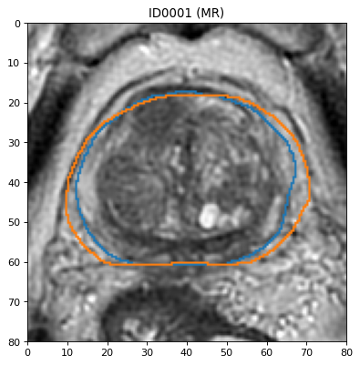
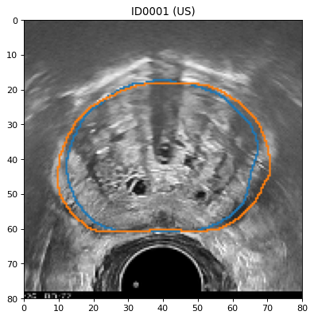
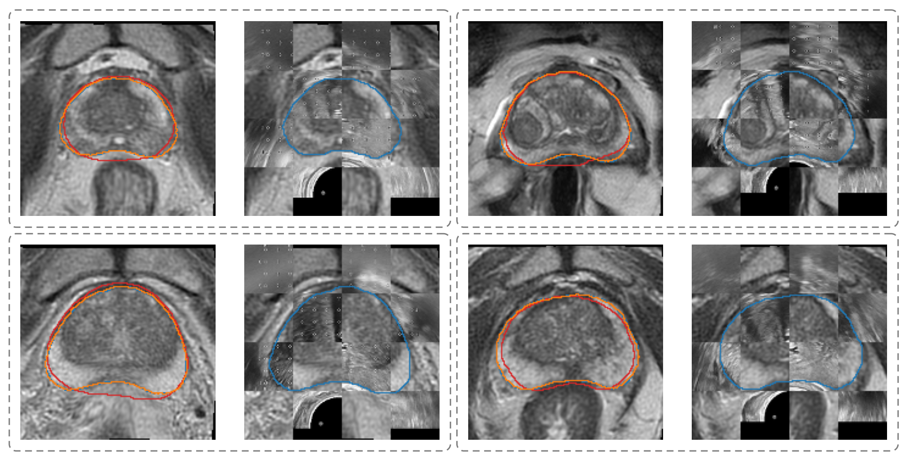

# Deep Learning in Prostate
Code for the PhD Thesis of Oscar J. Pellicer-Valero, [Contributions of biomechanical modeling and machine learning to the automatic registration of Multiparametric Magnetic Resonance and Transrectal Echography for prostate brachytherapy]() (*not yet available*).
It employs several Artificial Intelligence (AI) algorithms to analyze Magnetic Resonance (MR) and Ultrasound (US) images of the prostate and thereby improve the efficiency and accuracy in diagnosis, biopsy and treatment of prostate cancer. 

The PhD compiles the work developed in the following publications:
 - Oscar J. Pellicer-Valero, Victor Gonzalez-Perez, Juan Luis Casanova RamónBorja, Isabel Martín García, María Barrios Benito, Paula Pelechano Gómez, José RubioBriones, María José Rupérez, and José D. Martín-Guerrero. Robust Resolution-Enhanced Prostate Segmentation in Magnetic Resonance and Ultrasound Images through Convolutional Neural Networks. *Appl. Sci.*, 11(2):844, jan 2021. ISSN 2076-3417. doi: 10.3390/app11020844. URL https://www.mdpi.com/2076-3417/11/2/844
 - Oscar J. Pellicer-Valero, José D. Martín-Guerrero, and M.J. Rupérez. Cost-free resolution enhancement in Convolutional Neural Networks for medical image segmentation. *In Proc. ESANN*, pages 145–150, 2020a. URL https://www.esann.org/sites/default/files/proceedings/2020/ES2020-51.pdf
 - Oscar J. Pellicer-Valero, José L. Marenco Jiménez, Victor Gonzalez-Perez, Juan Luis Casanova Ramón-Borja, Isabel Martín García, María Barrios Benito, Paula Pelechano Gómez, José Rubio-Briones, María José Rupérez, and José D. Martín-Guerrero. Deep learning for fully automatic detection, segmentation, and Gleason grade estimation of prostate cancer in multiparametric magnetic resonance images. *Sci. Rep.*, 12(1):2975, dec 2022. ISSN 2045-2322. doi: 10.1038/s41598-022-06730-6. URL https://www.nature.com/articles/s41598-022-06730-6
 - Oscar J. Pellicer-Valero, María José Rupérez, Sandra Martínez-Sanchis, and José D. Martín-Guerrero. Real-time biomechanical modeling of the liver using Machine Learning models trained on Finite Element Method simulations. *Expert Syst. Appl.*, 143: 113083, apr 2020b. ISSN 09574174. doi: 10.1016/j.eswa.2019.113083. URL https://linkinghub.elsevier.com/retrieve/pii/S0957417419308000
 - Oscar J. Pellicer-valero, Maria José Rupérez, Victor Gonzalez-perez, and José D. Martín-Guerrero. Deep learning contributions for reducing the complexity of prostate biomechanical models. In PhD F. Chinesta, PhD, E. Cueto, PhD, Y. Payan, PhD and J. Ohayon, editor, *Reduc. Order Model. Biomech. Living Organs.* Elsevier, 2022. *Accepted chapter, to be published by Elsevier in the last trimester of 2022.*
 
This repository includes code for:
 - Training a simple prostate segmentation CNN model (using [Promise12](https://promise12.grand-challenge.org/) data)
 - Performing MR-US prostate registration using Coherent Point Drift (CPD) for surface registration + Finite Element Method (FEM) interpolation for predicting the displacement within the gland
 - Trainign a MR-US prostate registration CNN model based on the ground truth Dense Deformation Fields (DDFs) obtained in the previous step using CPD + FEM

Additionally, this repository includes two prostate MR-US pairs for testing the code, as well as pretrained segmentation and registration models. Unfortunately, no additional data can be made available due to regulatory constrains.
 
For prostate lesion detection, please refer to this repository: [https://github.com/OscarPellicer/prostate_lesion_detection](https://github.com/OscarPellicer/prostate_lesion_detection)
 
## Overview
This repository contains three main Jupyter Notebooks:
1. [RegistrationPreprocessing](git_RegistrationPreprocessing.ipynb):
      - Read all MR-US image pairs
      - Register MR rigidly (only translation) to US using the segmentation masks
      - Preprocess them: intentisty normalization, same size, etc.
      - Save them as: `ID_MR_img.nrrd`, `ID_MR_msk.nrrd`, `ID_US_img.nrrd`, `ID_US_msk.nrrd`, where ID is the ID of the patient

  |  
>MR image (left) and US image (right) with MR and US prostate masks on top. MR: Magnetic resonance, US: Ultrasound.

2. [RegistrationMeshing](git_RegistrationMeshing.ipynb):
      - Mesh the surfaces (and insides) of both prostate masks (MR and US)
      - Perform Coherent Point Drift (CPD) registration on the vertices
      - Interpolate the displacement field within the prostate to obtain the final DDF:
         - Linearly (to create some sort of benchmark to compare other possibilities against)
         - Non-linearly (kernel-based interpolation)
         - Use Finite Element Method (FEM) to simulate the behaviour of the internal points, when given surface displacements as boundary conditions. This requires installation of FeBIO
         

>Prostate MR to TRUS surface point set registration (first rigid and later non-rigid) employing the CPD algorithm. Every image corresponds with an iteration of the Expectation-Maximization algorithm (only a few iterations were included). MR: Magnetic resonance, TRUS: Transrectal ultrasound, CPD: Coherent Point Drift.

3. [ModelTraining](git_ModelTraining.ipynb):
      - Train either a segmentation or a registration (DDF prediction) model
      - Evaluate it or test on new images
      - Plot the results
      

>Transformed MRs using the predicted DDF for four test patients (one within each dashed box). Left image shows the deformed DDF along with the original MR prostate mask (in red) the US mask (in orange) and the transformed MR mask (in blue). Right image shows a checkerboard composite of the transformed MR image with the US image. MR: Magnetic resonance, US: Ultrasound, DDF: Dense deformation field
 
Since `itkwidgets` does not support Jupyter Lab 3 at the momment, Jupyter Notebook is the recommended working environment if you want to visualize 3D meshes within the Notebook. Otherwise, all the other libraries work nicely in both environments.

## Installation
To install, please clone this repository and install required packages. It is recommended to use a package manager such as pip or conda (conda was the only one tested, so use pip at your own risk). If not sure, you can download and install the [latest miniconda release](https://docs.conda.io/en/latest/miniconda.html) before continuing.

You probably want to create an environment first. Using conda:
```bash
conda create -n prostate_dl python=3.8
conda activate prostate_dl
```

Install required libraries using `conda` when possible:
```bash
conda install matplotlib numpy ipywidgets ipython scipy pandas jupyter jupyterlab>3 ipython scikit-learn scikit-image seaborn
conda install pytorch torchvision torchaudio cudatoolkit=11.3 tensorboard>1.15 -c pytorch
conda install -c conda-forge pytorch-lightning>1 cupy pyvista pygalmesh=0.9.7 meshio pydicom tqdm itkwidgets torchinfo torchio
conda install SimpleITK -c simpleitk
conda install -c open3d-admin open3d
pip install probreg
```

Install git and clone this repeository
```bash
conda install git
cd ~
git clone https://github.com/OscarPellicer/Deep-Learning-in-Prostate-PhD.git
```

You will also need [`plot_lib`](https://github.com/OscarPellicer/plot_lib) for plotting the medical images within the Jupyter Notebooks. To install it, you may simply clone the repository to your home path: 
```bash
cd ~
git clone https://github.com/OscarPellicer/plot_lib.git
```

Finally, for performing simulations using FEM, [FeBIO](https://febio.org/) needs to be installed as well. You will need to sign up to access the [downloads section](https://febio.org/downloads/), or you might alternatively [build FeBIO from source](https://github.com/febiosoftware). Only FeBIO itself is needed, but it is recommened to install the whole FeBIO Studio bundle to be able to open `.feb` files and inspect the complete simulation results if needed. Make sure that `febio3` is a command in your console, or add febio3 to path if it is not; otherwise python will not be able to launch the simulations.

## Usage
### [RegistrationPreprocessing](git_RegistrationPreprocessing.ipynb)
This Notebook prepares MR and US images for registration, by resmpaling them and performing a very simple rigid registration (only translation). There is little to configure in this Notebook, simply run the Notebook, and the images that have been made available from two patients within `registration_data/images` folder will automatically be loaded and preprocessed into `registration_data/preprocessed` folder.

### [RegistrationMeshing](git_RegistrationMeshing.ipynb)
This Notebook takes the preprocessed images from `registration_data/preprocessed`, and fiducials from `registration_data/fiducials` (created using [Slicer](https://www.slicer.org/)) and generates a DDF for every patient. The prostate surfaces are matched with CPD, while the inside of the gland is interpolated using either `linear`, `kernel`-based non-linear interpolation, or the FEM to simulate the biomechanical behavior within the gland given the surface displacements as boundary conditions (which requieres creating a mesh from the masks using `pygalmesh`). These DDFs are just 3-channel 3D images that represent a vector field of how much each voxel in the MR image should move to become the US image. Note that this field will only be valid within the prostate.

Some of the configurable parameters that can be edited in the Notebook are:
 - `QUICK_MODE= True` Much quicker meshing (but not as smooth). If set to False, additional post-processing are applied to the mesh in order to improve its quality. In practice, `QUICK_MODE` has proven enough for our purposes.
 - `USE_CUDA= False` Use CUDA for CPD registration (much faster) through `cupy`.
 - `REGISTER_RIGID= True` Perform rigid CPD registration before non-rigid. It is recommended, as it leads to a better initialization for the non-rigid registration.
 - `USE_FEM= False` Interpolate internal displacement field using FEM (requires FeBIO installed in the system).
 - `fem_material= dict(material='neo-Hookean', density=str(1.), E=str(5000.), v=str(0.49))` FEM material properties
 
Also, there are several parameters for the CPD and the interpolation (used when `USE_FEM= False`) that can be set as a list, and the Notebook will go over all configurations (used for grid-serching over the hyperparameter space). Set a single element within the list to avoid the grid-searching behavior:
 - `betas= [100.]` Beta CPD parameter.
 - `lambdas= [3.3]` Lambda CPD parameter
 - `all_kernels= ['thin_plate_spline']` Interpolation kernel, best results are achieved with either 'linear' or 'thin_plate_spline'. See [RBFInterpolator](https://docs.scipy.org/doc/scipy/reference/generated/scipy.interpolate.RBFInterpolator.html) for more possible kernels and interpolation parameters.
 - `epsilons= [100.]` Interpolation kernel scale.  Not used for kernels 'thin_plate_spline', 'linear', or 'cubic'. See [RBFInterpolator](https://docs.scipy.org/doc/scipy/reference/generated/scipy.interpolate.RBFInterpolator.html)

### [ModelTraining](git_ModelTraining.ipynb)
This Notebook trains either a segmentation or a registration (DDF prediction) model, (or loads a pretrained model), evaluates it on test images, and plots the results. To choose one model or the other, change the `PROBLEM` variable within the Notebook to one of:
 - 'SEG_MR': Prostate MR segmentation problem
 - 'DDF': 'Dense deformation field estimation problem from MR / US pairs with corresponding prostate masks'
 
By choosing either one (or whatever new custom problems you define) much of the configuration will change in the rest of the Notebook. By default, the backend for both models will be the VNETLight module from [Medzoo](https://github.com/black0017/MedicalZooPytorch/blob/master/lib/medzoo/Vnet.py). Only two modifications were made to this module: batch normalization was replaced by instance normalization (i.e. with instance normalization, standarization is applied instance-wise and channel-wise, instead of being batch-wide), and the PReLU activation function was used (which is just like a ReLU, but the slope is learned channel-wise).

**Prostate segmentation**
By default he Notebook has been set up to train a basic segmentation model on the [Promise12](https://promise12.grand-challenge.org/) dataset. Please, download the data and update this variable within the notebook `data_path= 'D:/oscar/Prostate Images/Promise12/Train'` to proint to where the Promise12 training data is located.

If you want to use pretrained weights, set `LOAD_NAME` variable to the path where the weights are stored. Unfortunately, no weights are provided for MR prostate segmentation, but they can be computed by training on Promise12 for instance.

**Prostate registration**
If `PROBLEM= DDF`, please set `TRAIN= False` and `BLIND_PREDICT= True` (unless you provide your own training data). Then download the pretrained registration weights from [here](https://drive.google.com/drive/folders/1A1-wkRBK0CP8Vh-iPKeuIjZXDEaBl42D) and save them into a `weights` folder in root path. Then run the Notebook to evaluate it on the two patient examples provided in this repository. Please note that both previous Notebooks should have been run to produce the intermediate files that are needed to evaulate the registration network, and in particual, [RegistrationMeshing](git_RegistrationMeshing.ipynb) Notebook should have been run twice setting `USE_FEM= True` and `USE_FEM= False` to have both references to compare with (or use the files already provided in this repository).

## Contact
If you have any problems, please check further instructions in each of the provided Notebooks, create a new Issue, or directly email me at Oscar.Pellicer at uv.es